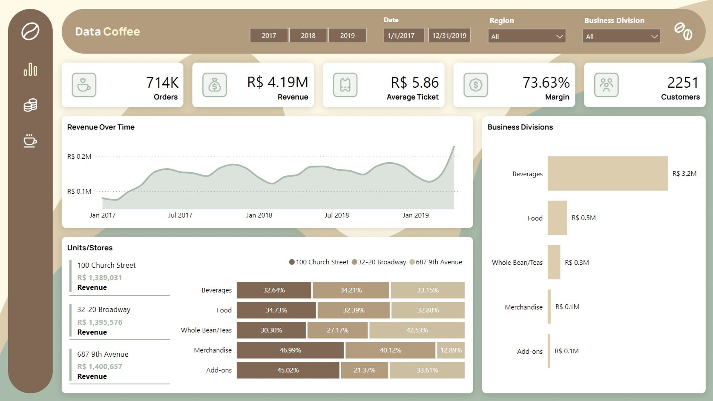
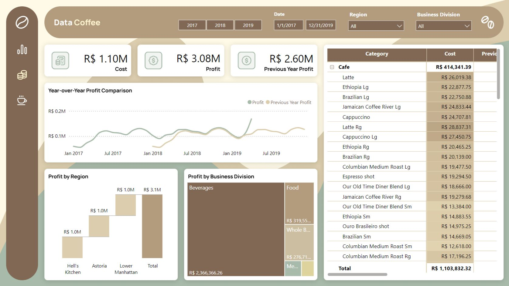
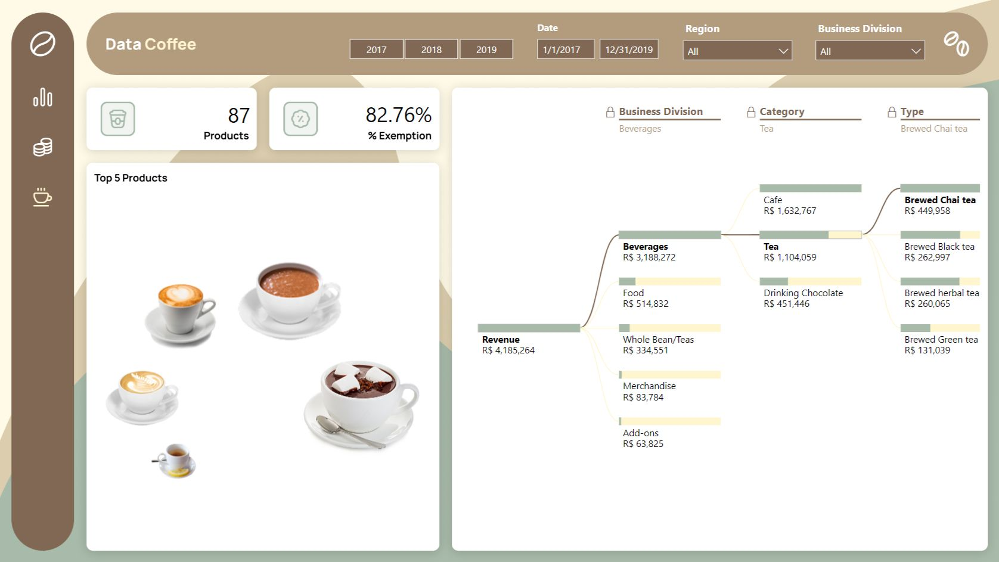

# ☕ Data Coffee Dashboard in Power BI

This is one of the dashboard templates from the Comunidade Data Driven, but with modifications I made.

💡Main KPIs:
- Orders, Revenue, Average Ticket, Margin, Customers.
- Cost, Profit, Previous Year Profit.
- Products, % Exemptation.

📌Main visuals:
- Revenue Over Time, Year-over-Year Profit Comparison, Top 5 Products.

🔗 Link to the dashboard: https://lnkd.in/diZvgg6D
